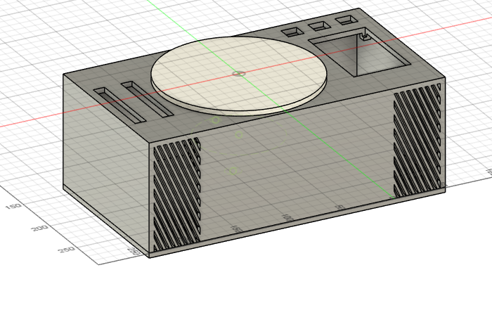
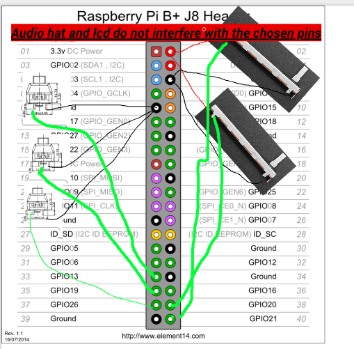

# Digital Turntable Stereo Machine with Touch Control
[Read the project build journal](journal.md) for detailed progress updates and technical notes.

## Description
This is a custom-built digital turntable stereo machine featuring a rotating platter controlled by a brushless motor with gear reduction. The system uses an RP2 microcontroller for dual-core audio processing and motor control. User interface includes two sliding potentiometers (speed and volume), three Cherry MX switches for functions, and a touch screen LCD for song display and navigation.

**Additional Feature:** The system can also function as a high-quality amplifier for external instruments like piano or keyboard. A 1/4" TRS input jack allows direct connection, with the ability to switch between turntable mode and external input mode via the touch screen interface.

## Why I Made This
I wanted to create a tactile music experience that combines the physical control of traditional turntables with modern digital audio capabilities. The rotating platter can be manually moved for cueing and scratching while maintaining precise motor control for consistent playback speeds. Adding piano amplification functionality makes this a versatile audio system for both playback and live performance.

## Images
### Physical Build (not done yet)

### Full 3D Model

### Wiring Diagram

## Bill of Materials (BOM)

| Item                | Description                                    | Qty | Unit Price (USD) | Total Price (USD) | Notes                        |
|---------------------|------------------------------------------------|-----|------------------|-------------------|------------------------------|
| Brushless Motor     | BLDC Motor for platter drive                  | 1   | $0.00            | $0.00             | Already owned                |
| Gear Reduction      | 3D printed gear system (TBD ratio)            | 1   | $0.00            | $0.00             | Custom 3D printed parts      |
| Speakers            | 4" Full Range Speakers 8Ω 20W (Pair)          | 1   | $0.00            | $0.00             | Already owned                |
| Audio HAT           | Audio processing module                        | 1   | $0.00            | $0.00             | Already owned                |
| Touch LCD           | 3.5" TFT Touch Screen 480x320 SPI             | 1   | $0.00            | $0.00             | Already owned                |
| Potentiometers      | 10kΩ Sliding Potentiometers                   | 2   | $2.95            | $5.90             | Speed and volume control     |
| Cherry MX Switches  | Cherry MX Blue Mechanical Switches            | 3   | $0.00            | $0.00             | Already owned                |
| Audio Input Cable   | 1/4" TRS to 3.5mm Audio Cable                 | 1   | $14.99           | $14.99            | Piano/keyboard input         |
| Microcontroller     | Raspberry Pi Zero 2W                          | 1   | 26.99            | $26.99             | computation board              |
| Cables & Adapters   | USB charging, mini HDMI, SD card adapter      | 1   | $0.00            | $0.00             | Already owned                |
| Cherry MX Keycaps   | Mechanical keyboard keycaps (10-pack)         | 1   | $5.95            | $5.95             | Function key labels          |
| Heat Sink           | Aluminum heat sink set for RPi                | 1   | $5.99            | $5.99             | Temperature management       |
| Rotary Encoder      | Infinite rotation encoder                      | 1   | $0.00            | $0.00             | Platter position feedback    |
| SD Card             | 32GB MicroSD Card                              | 1   | $6.99            | $6.99             | Audio file storage           |
| Flat HDMI Cable     | Mini HDMI to HDMI Flat Cable                  | 1   | $3.95            | $3.95             | Display connection for RPi Zero 2W |
| Case                | 3D printed enclosure                           | 1   | $0.00            | $0.00             | Custom housing for components|
| **Subtotal**        |                                                |     |                  | **$68.81**        |                              |

*Note: Many components are already owned, significantly reducing project cost.*

You can also download and open [bom.csv](bom.csv) directly to see all rows.

