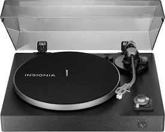
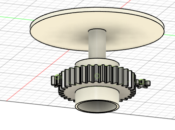
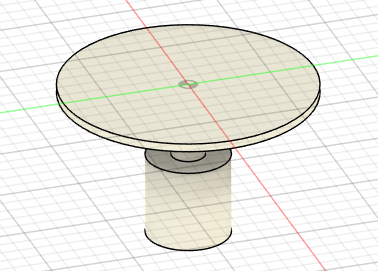
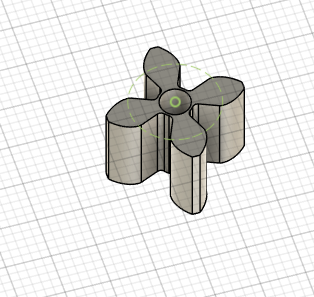
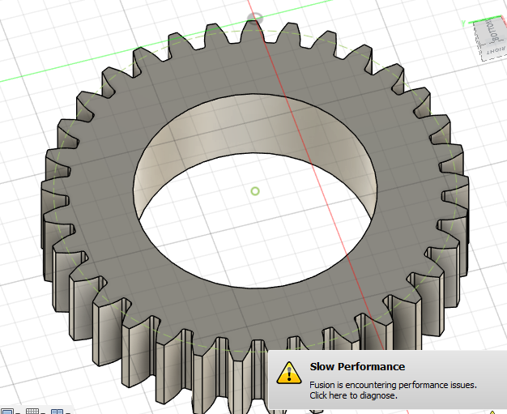
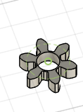
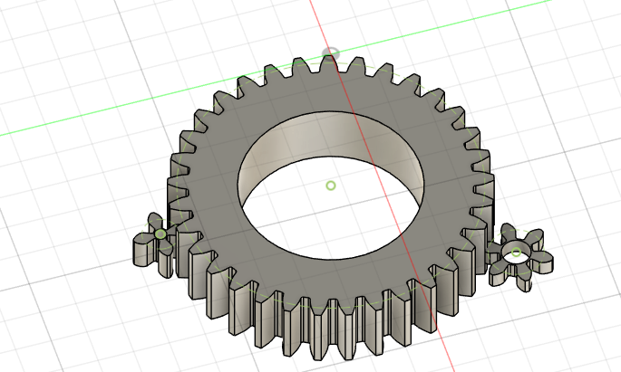
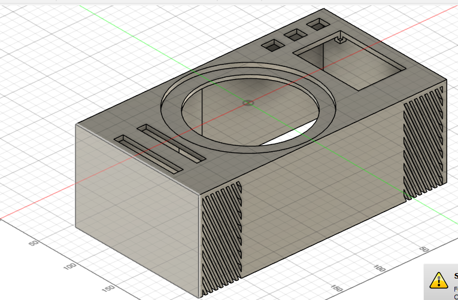
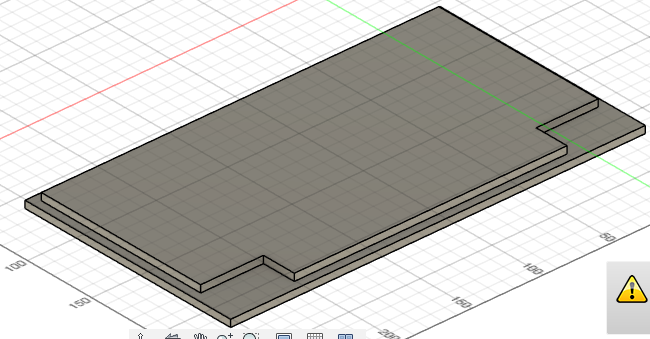

### Date: 2025-06-18

**Time Spent:** 2.5 hours
**Task:** Research — Understanding How Turntable/Stereo Machines Work

i watch some teardown vids and read around abt how theese stero machines work. took notes fast so its kinda scattered but heres what i got

**digital turntable stereo stuff:**

* **Power:** system takes in 12v DC, that’s what feeds the rest (motor/speakers/mcu)
* **Motor thing (ESC):** tells the brushless motor how fast/strong 2 go, uses PWM
* **BLDC motor + gears:** spins fast, gears slow it to 33/45rpm.
* **platter/disk:** the thing u spin manually or auto (scratching too lol)
* **sound system:** uses rp2 microcontroller + dac, sends music to speakers
* **controls:** sliders 4 speed & vol, 3 MX buttons, touchscreen too
* **microcontrollr:** does all the thinking - audio, spinning, buttons, screen

---

### Date: 2025-06-19

**Time Spent:** 2 hours
**Task:** Research — Motor Control and Audio Processing Integration

looked into the rp2 dual core use 4 audio + motor at the same time. drew out gear system too.

## Key Concept

im trying to mix real disk feel w/ digital music, so u can scratch or cue by hand but still play mp3s. rp2 does both jobs together.

## Gears i planned

* big gear (4t): on the disk shaft
* smol gear (4t): connected to the motor
* encoder gear (6t): for the feedback

ratio = 1:1 for motor and platter
encoder sees 1.5x turns for more accuracy

## basic system

**music path:**
file > rp2 audio core > audio hat > speakers

**motor path:**
slider pot > adc > rp2 > pwm > esc > motor > gearz > platter

**interface:**
manual spin > encoder > rp2 > update song spot
MX buttons > rp2 > triggers
touchscreen > spi/i2c > screen stuff

---

### Date: 2025-06-24

**Time Spent:** 2 hours
**Task:** Fabrication — Creating Top Cover with Interface Cutouts

made the top panel 4 the case. it holds all the buttons + screen + sliders. looks ok

## features

* 3 holes 4 Cherry MX buttons
* long holes for speed/vol sliders
* middle rectangle for the LCD
* cut it from MDF like the rest
* holes 4 mounting screws

protects insides but still lets u use everything

---

### Date: 2025-06-25

**Time Spent:** 30 minutes
**Task:** Fabrication — Creating Bottom Base Panel

made the base (bottom part) of the case so now it’s like a real box lol

## what it has

* solid MDF base
* speaker spots (recessed a bit)
* part that can be opened 4 repairs
* holds stuff in place strong

finishes the shell so now its enclosed

---

### Date: 2025-06-26

**Time Spent:** 2 hours
**Task:** Wiring and Component Testing

wired all parts + tested on pi zero W (didnt work great so swapped it)

## wiring setup

**GPIOs used:**

* i2s pins > audio hat
* i2c+spi > LCD screen
* buttons > digital pins w/ pullups
* sliders > i2c ADC
* motor > pwm pin
* encoder > 2 input pins (quad signal)

**shared buses to save pins**

## results

**on Pi Zero W:**

* motor ran fine
* audio lagged bad
* screen was slow
* pi couldn’t do both well

**issues:**

* audio breaks up
* screen lags = bad UX
* CPU not enough

**fix:**

* moved to pi zero 2W
* quad core fixed all that
* same shape so easy swap
* everything runs smooth now

---

### Date: 2025-06-27

**Time Spent:** 4 hours
**Task:** Software Development — Creating Turntable Player Application

wrote a full python app that plays music, spins disk, shows screen stuff, all that.

## features

**player stuff:**

* plays mp3s w/ pygame
* finds music in `/home/pi/Music/`
* gets song name, artist, album etc
* shows album art too
* playlist with shuffle

**hardware:**

* MX buttons do play/pause etc
* sliders read by SPI ADC
* sliders control speed + vol live
* button states managed

**screen:**

* pygame GUI on LCD
* shows song data
* art shows nice
* has vol/speed indicators
* progress bar too

**audio:**

* speed change 0.5x to 2x
* vol slider mapped live
* works w/ audio HAT
* BT toggle too

**system stuff:**

* multithreaded so it don’t lag
* updates at 10hz
* runs at boot with systemd
* shuts down clean

## status

software is mostly DONE:

* 4 scripts, \~400 lines
* split into modules
* hardware layer added
* install script done too

**NOT tested on real thing yet.** need to plug it in & try IRL

