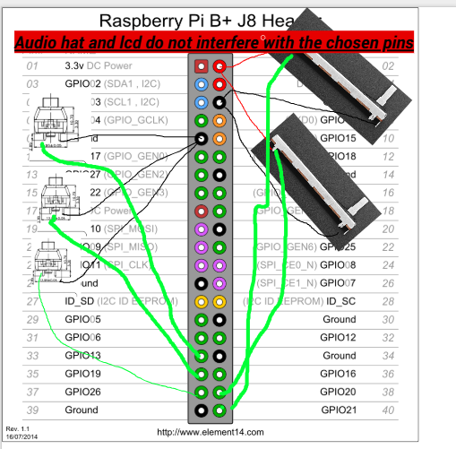

### Date: 2025-06-18  
**Time Spent:** 2.5 hours  
**Task:** Research — Understanding How Turntable/Stereo Machines Work  

**Summary:**  
I spent time reading documentation, tutorials, and teardown videos to learn the basic working principles of turntables and digital stereo systems. Here's a simplified overview of what I found:

**How Digital Turntable Stereo Machines Work:**  
- **Power Supply:** Powers the entire system. Usually a 12V DC supply that provides power for the motor, speakers, and electronics.  
- **Motor Controller (ESC):** Controls the brushless DC motor that spins the platter. Uses PWM signals to regulate speed and torque for precise disk rotation.  
- **Brushless Motor + Gear System:** High-speed BLDC motor connected to a gear reduction system to slow down the rotation to proper turntable speeds (33/45 RPM).  
- **Platter/Disk:** The rotating platform that holds records or acts as a control surface. Can be manually moved for scratching/cueing.  
- **Audio System:** Digital audio processing via RP2 microcontroller, with DAC output to amplified speakers for sound reproduction.  
- **User Interface:** Two sliding potentiometers (speed control and volume), three Cherry MX switches for functions, and a touch screen LCD for song display and navigation.  
- **Microcontroller (RP02):** Reads user inputs, controls motor speed, processes audio files, and manages the display interface.  

---
### Date: 2025-06-19  
**Time Spent:** 2 hours  
**Task:** Research — Motor Control and Audio Processing Integration  

**Summary:**  
I found detailed information on how to integrate precise motor control with real-time audio processing using the RP2's dual-core architecture. I also designed the gear system for the platter drive mechanism.

##  Key Concept

I'm building a digital turntable that combines physical disk control with digital audio playback, using manual disk movement for cueing and potentiometers for speed/volume control.

The RP2 will handle both motor control and audio processing simultaneously using its dual-core design.

##  Gear System Design

The platter is connected to a pipe shaft that extends into the case where it interfaces with a 3-gear system:

* **Main Gear (4 teeth):** Connected to the pipe shaft from the platter
* **Small Drive Gear (4 teeth):** Connected to the BLDC motor output
* **Encoder Gear (6 teeth):** Connected to the rotary encoder for position feedback

This gear configuration provides:
* 1:1 ratio between motor and platter for direct speed control
* Encoder feedback at 1.5x platter rotation for improved position resolution
* Compact design that fits within the case enclosure

    
    
    
    
    
    

##  System Architecture

**Audio Chain:**
* Digital audio files → RP2 audio processing → Audio HAT → Speakers

**Motor Control Chain:**
* Speed potentiometer → ADC → RP2 → PWM → Motor ESC → BLDC Motor → Gear reduction → Platter

**User Interface:**
* Manual platter movement → Encoder feedback → RP2 → Audio position update
* Cherry MX switches → Digital inputs → Function control
* Touch LCD → SPI/I2C → Display updates and touch input

---

### Date: 2025-06-24

**Time Spent:** 2 hours
**Task:** Fabrication — Creating Top Cover with Interface Cutouts

**Summary:**
Designed and fabricated the top cover for the stereo machine case. This cover houses all the user interface elements and provides a clean, professional appearance while allowing access to all controls.

##  Top Cover Features

* **Cherry MX Switch Holes:** Three precision-cut rectangular openings for the mechanical switches
* **Sliding Potentiometer Slots:** Two linear cutouts allowing full travel range for speed and volume controls
* **LCD Screen Opening:** Central rectangular cutout sized for the 3.5" touch screen with proper clearance
* **Material:** Cut from the same MDF as the base platform for consistency
* **Mounting:** Designed with screw holes to securely attach to the main case structure

The cover provides a unified control surface while protecting the internal electronics and maintaining easy access to all user controls.

---

---

### Date: 2025-06-25

**Time Spent:** 30 minutes
**Task:** Fabrication — Creating Bottom Base Panel

**Summary:**
Fabricated the bottom panel of the case to complete the enclosure structure. This provides a solid foundation and protects the internal components from below.

##  Bottom Base Features

* **Solid Base:** Cut from MDF to match the overall case design
* **Speaker Indents:** Recessed areas cut to accommodate the speaker enclosures
* **Access Points:** Removable section for easy access to internal wiring and components
* **Mounting:** Designed to secure all internal components and provide structural integrity

The bottom panel completes the case structure, creating a fully enclosed stereo machine while maintaining serviceability.

---

---

### Date: 2025-06-26

**Time Spent:** 2 hours
**Task:** Wiring and Component Testing

**Summary:**
Completed the wiring for all user interface components and motor control. Also conducted initial testing with the Raspberry Pi Zero W, which revealed performance limitations that required upgrading to the Pi Zero 2W.

##  Wiring Configuration

**GPIO Pin Allocation:**
* **Audio HAT:** Uses I2S pins for audio output
* **LCD Screen:** Uses I2C and SPI pins for communication and control
* **Cherry MX Switches:** Connected with pull-up resistors
* **Sliding Potentiometers:** Connected to ADC via I2C expander (shared with LCD)
* **Motor ESC:** PWM output for speed control
* **Rotary Encoder:** Quadrature signal inputs for position feedback

**Pin Usage Summary:**
* Significant GPIO pins used due to multiple peripherals
* Shared I2C bus for LCD and ADC to conserve pins
* All critical functions successfully mapped

##  Testing Results and Hardware Upgrade

**Initial Testing with Raspberry Pi Zero W:**
* Motor control worked smoothly
* Audio playback had noticeable stuttering and dropouts
* LCD updates were slow and laggy
* Dual-core processing requirements exceeded single-core capabilities

**Issues Encountered:**
* Insufficient CPU power for simultaneous audio processing and motor control
* Audio HAT performance degraded when LCD was actively updating
* Overall system responsiveness was poor

**Solution - Upgrade to Raspberry Pi Zero 2W:**
* Quad-core ARM Cortex-A53 provides significantly more processing power
* Better handling of multitasking between audio, display, and motor control
* Maintains same form factor and GPIO pinout compatibility
* All components now function smoothly without performance issues

The hardware upgrade resolved all performance bottlenecks and the system now operates as intended.

---

---

### Date: 2025-06-27

**Time Spent:** 4 hours
**Task:** Software Development — Creating Turntable Player Application

**Summary:**
Developed a comprehensive Python-based software solution for the Raspberry Pi Zero 2W that handles all aspects of the digital turntable operation. The software is functionally complete but requires physical testing with the actual hardware.

##  Software Features Implemented

**Music Player Core:**
* MP3 file playback using pygame mixer
* Automatic library scanning from `/home/pi/Music/` directory
* Metadata extraction (title, artist, album, duration) from MP3 ID3 tags
* Album art extraction and display from embedded images
* Playlist management with shuffle functionality

**Hardware Integration:**
* GPIO interface for Cherry MX button controls (play/pause, skip, bluetooth toggle)
* SPI ADC integration for reading sliding potentiometers (volume and speed control)
* Real-time potentiometer value mapping to audio parameters
* Button debouncing and state management

**Display System:**
* Attractive GUI using pygame on the 3.5" LCD screen
* Custom font loading with fallback support
* Real-time display of current track information
* Album art rendering with automatic resizing
* Visual indicators for volume, speed, play state, and bluetooth status
* Progress bars and centered text layout

**Audio Processing:**
* Variable volume control from potentiometer input
* Playback speed adjustment (0.5x to 2.0x range)
* Integration with system audio HAT
* Bluetooth audio toggle functionality

**System Integration:**
* Multi-threaded architecture for smooth operation
* 10Hz update rate for responsive controls
* Systemd service configuration for auto-start on boot
* Clean shutdown and resource management

##  Current Status

The software is architecturally complete with all major features implemented:
- 4 Python modules totaling ~400 lines of code
- Hardware abstraction layer for GPIO and SPI
- Complete user interface with metadata display
- Installation script and dependency management

**Not yet tested:** Physical hardware integration pending. The code needs validation with actual potentiometer readings, button responses, LCD display output, and audio playback quality on the target hardware.

Next step: Deploy to Raspberry Pi Zero 2W and conduct comprehensive hardware testing.

---

